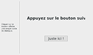
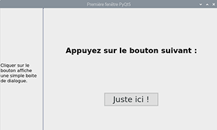
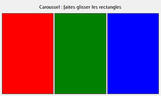
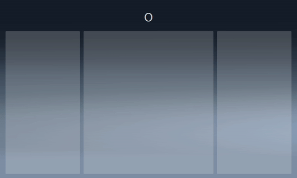

# QTesting

Personal project(s) to learn/discover the Qt framework.

## Qt Experiments

| [TestWindowUsingPureQt](./TestWindowUsingPureQt) | [TestWindowUsingQtDesigner](./TestWindowUsingQtDesigner) | [CppQtGUI_Tutorial](./CppQtGUI_Tutorial) | [PyQtCarousel](./PyQtCarousel) |
| :---------------: | :----------------------: | :-------------: | :-------------: |
|  |  |  |  |
| _Basic project to learn how to create a PyQt5 app using only Qt5 for Python_ | _Project to learn how to create a PyQt5 app using QtDesigner_ | _Basic project to learn how to create a Qt5 app using C++_ | _Simple carousel using Qt5 for Python_ |

| [QDashboard](./QDashboard) |
| :---------------: |
|  |
| _Instrument cluster using Qt5 for Python (just started)_ |

## Built with..

Softwares and technologies :

- [QtCreator](https://www.qt.io/product/development-tools) - IDE used for C++ dev / use Qt Designer included to conceive the .ui files
- [PyQt](https://wiki.python.org/moin/PyQt) (version 5) - GUI programming framework
- [python3](https://www.python.org/downloads/) - interpreted programming language
- [C++]() - compiled programming language

Optional equipment :

- RaspberryPi + 7" touchscreen monitor (not necessary but windows are dimensioned for it)