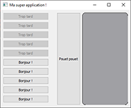

# QTesting

Personal project(s) to learn/discover the Qt framework.

## Qt Experiments

| [TestWindowUsingPureQt](./TestWindowUsingPureQt) | [TestWindowUsingQtDesigner](./TestWindowUsingQtDesigner) | [CppQtGUI_Tutorial](./CppQtGUI_Tutorial) |
| :---------------: | :----------------------: | :-------------: |
|  |  |  |
| _project description here.._ | _project description here.._ | _project description here.._ |

## Built with..

"Technologies" :

- [QtCreator](https://www.qt.io/product/development-tools) - ....... IDE used / Qt Designer .............
- [PyQt](https://wiki.python.org/moin/PyQt) (version 5) - ........ ""2D and 3D graphics/hmi/gui"" API ......
- [python3](https://www.python.org/downloads/) - ..............
- [C++]() - ..............

"Material" :

- RaspberryPi + Pi display (not necessary but windows are dimensioned for it)